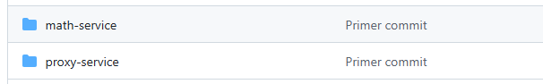
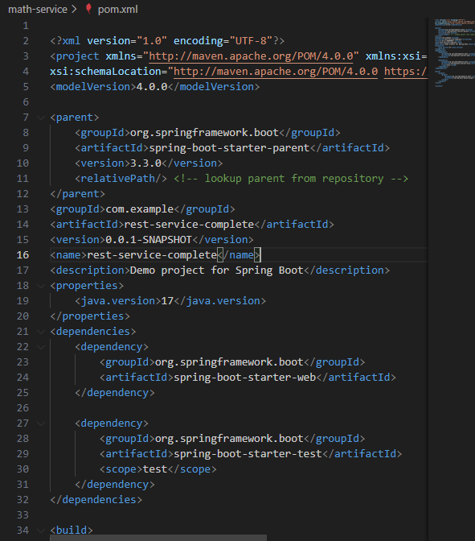
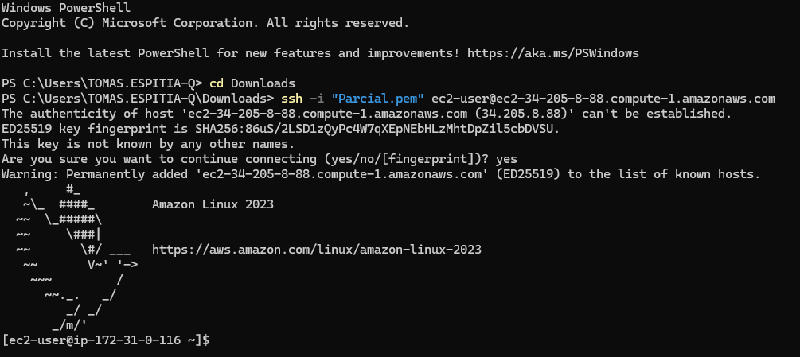
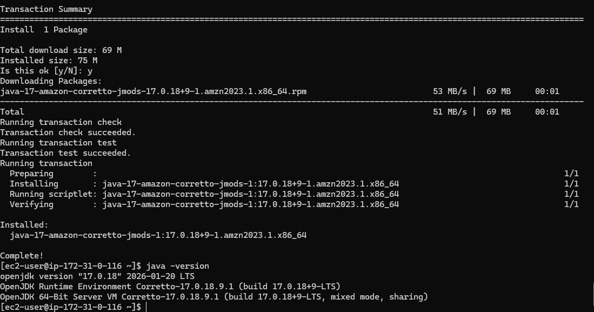
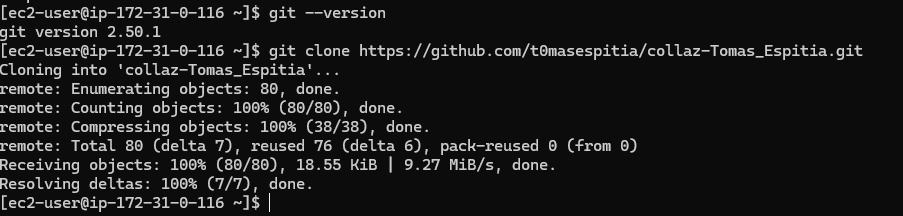
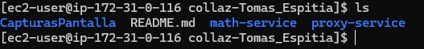
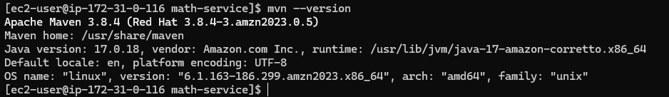
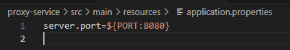
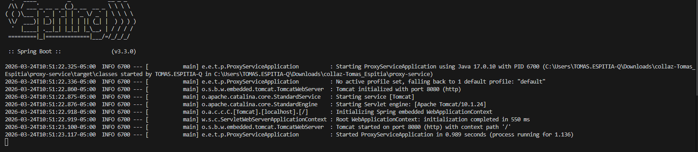

# collaz-Tomas_Espitia
# Paso a paso de como se fue solucionando el parcial

## Primero creaamos el repositorio
https://github.com/t0masespitia/collaz-Tomas_Espitia.git
## Luego creamos dos carpeta la cual llamamos math-service y proxy-servise(En cada una hicimos un pom y un proyecto maven distinto para asi no confundirme con el funcionamiento de cada una)

## Luego modificamos el  pom con el que el profesor nos proporciono

## Luego creamos las clases que nos da previamente como controllers
## Ahora vamos a crear la instancia en aws para poder seguir con el parcial

Le abilitamos en puerto 22 y el puerto 8080 a cada una ya que son los que vamos a utilizar
## Nos conectamos por medio de ssh con el siguiente comando
### ssh -i "Parcial.pem" ec2-user@ec2-34-205-8-88.compute-1.amazonaws.com

## Realizamos la instalacion de java 

## Ahora vamos a desplegar nuestro repositorio dentro de la instacia de aws

## Revisamos que haya quedado bien clonado

## Instalamos maven 

## Verificamo que en proxy podamos prender el servidos la cual esta por el puesto 8080

