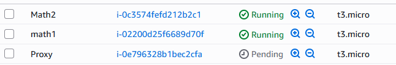

# collaz-Tomas_Espitia
## Paso a paso de como se fue solucionando el parcial

### Primero creaamos el repositorio
https://github.com/t0masespitia/collaz-Tomas_Espitia.git
### Luego creamos dos carpeta la cual llamamos math-service y proxy-servise(En cada una hicimos un pom y un proyecto maven distinto para asi no confundirme con el funcionamiento de cada una)

### Luego modificamos el  pom con el que el profesor nos proporciono

### Luego creamos las clases que nos da previamente como controllers
### Ahora vamos a crear 3 instancias en aws para poder seguir con el parcial

Le abilitamos en puerto 22 y el puerto 8080 a cada una ya que son los qu evamos a utilizar
### Nos conectamos por medio de ssh

### Realizamos la instalacion de java 

### Ahora vamos a desplegar nuestro repositorio dentro de la instacia de aws

### Instalamos maven 
